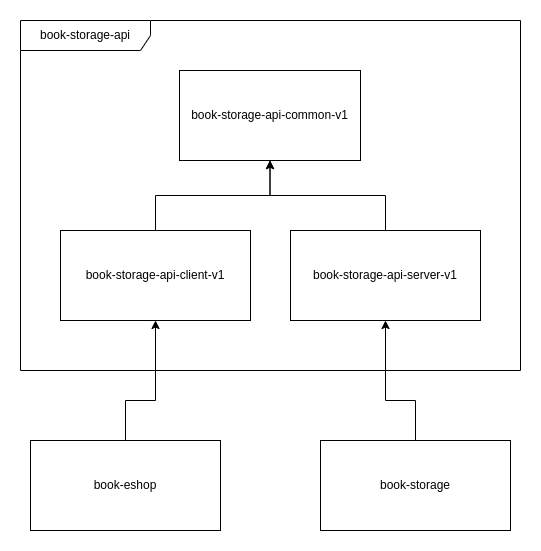
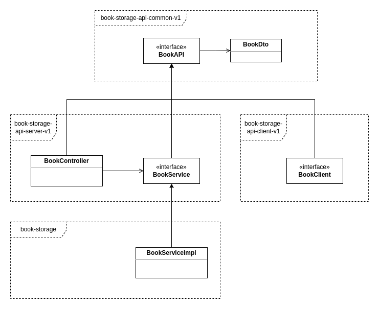

# Java REST API Evolution Blueprint (J-RAEB)

This project aims to describe the best possible way to define, develop, share and evolve REST APIs in a Java-based microservice systems.

# Properties

- Provides a single place for API definitions for both clients and servers (eliminates duplications).
- Ensures compile-time compatibility between clients and servers.
- Provides an easy way to create new incompatible API versions while retaining support of older versions at the same time.
- Supports both non-reactive and reactive APIs
- Takes advantage of modern frameworks used for producing/consuming REST APIs in Java (Spring MVC / WebFlux, Feign / Feign Reactive)

# Design Outline

For better clarity, the design will be demonstrated on a simple demo project - a book storage microservice which provides basic CRUD operations on books.

The basic principle is extracting the microservice API into a project which is separate from the microservice project. In our example, the microservice project is named `book-storage` and the API project is named `book-storage-api`.

Furthermore, the `book-storage-api` is divided into 3 modules, each compiled into a separate Maven artifact: `book-storage-api-common-v1`, `book-storage-api-server-v1`, `book-storage-api-client-v1`.

## API Module Descriptions

### book-storage-api-common-v1

This artifact contains classes which are used by both servers (API providers) and clients (API consumers).

Namely:

- REST Endpoint declarations (interfaces)
- DTO object definitions (POJOs)
- Other common definitions (constants, exceptions, etc.)

### book-storage-api-server-v1

Contains declarations of classes, which are needed by servers - microservices which provide the respective API.

Namely:

- Spring MVC or WebFlux controllers
- Declarations of interfaces for services which provide the actual API functionality
- Other server-side functionality (filters, exception handling, etc.)

### book-storage-api-client-v1

Contains declarations of classes, which are needed by clients - microservices which consume the respective API.

Namely:

- Feign / Feign Reactive clients
- Interceptors, converters, etc.

## Microservice Descriptions

### book-storage

The actual microservice which provides the API.

### book-eshop

A sample microservice which demonstrates how to connect to the API.

## Class Hierarchy

